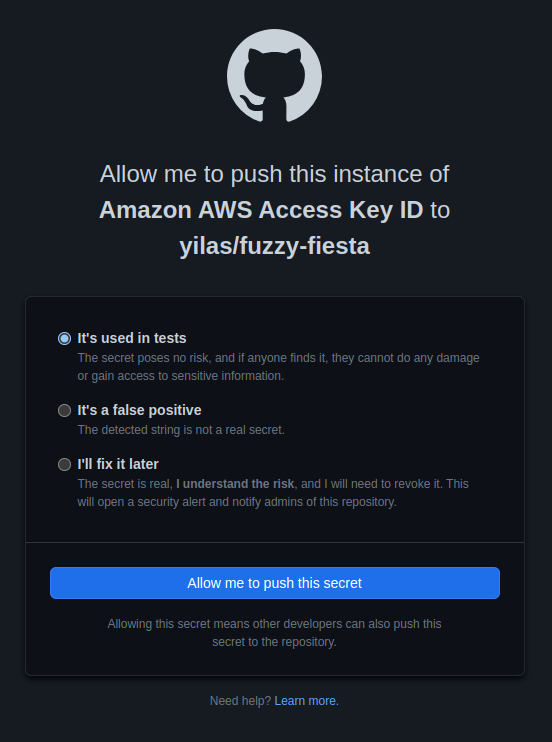

# fuzzy-fiesta

## Test de push de clés AWS (access key et secret access key)

```bash
git push
```

```log
Enumerating objects: 4, done.
Counting objects: 100% (4/4), done.
Delta compression using up to 8 threads
Compressing objects: 100% (3/3), done.
Writing objects: 100% (3/3), 383 bytes | 383.00 KiB/s, done.
Total 3 (delta 0), reused 0 (delta 0), pack-reused 0
remote: error GH009: Secrets detected! This push failed.
remote: 
remote:             GITHUB PUSH PROTECTION
remote: ——————————————————————————————————————————————————————
remote:  Resolve the following secrets before pushing again.
remote: 
remote:  (?) Learn how to resolve a blocked push
remote:  https://docs.github.com/code-security/secret-scanning/pushing-a-branch-blocked-by-push-protection
remote: 
remote: 
remote: —— Amazon AWS Access Key ID ——————————————————————————
remote:  locations:
remote:    - commit: a1cc356a479372f1c5e45df1cad1de640e58fa16
remote:      path: test_aws.txt:1
remote: 
remote:  (?) To push, remove secret from commit(s) or follow this URL to allow the secret.
remote:  https://github.com/yilas/fuzzy-fiesta/security/secret-scanning/unblock-secret/2Sq4QTXidwRsOYCRAr73rUdyGwP
remote: 
remote: 
remote: —— Amazon AWS Secret Access Key ——————————————————————
remote:  locations:
remote:    - commit: a1cc356a479372f1c5e45df1cad1de640e58fa16
remote:      path: test_aws.txt:2
remote: 
remote:  (?) To push, remove secret from commit(s) or follow this URL to allow the secret.
remote:  https://github.com/yilas/fuzzy-fiesta/security/secret-scanning/unblock-secret/2Sq4QTUMJhBUDvmjMG1uYWsxu1k
remote: 
remote: 
remote: 
To https://github.com/yilas/fuzzy-fiesta.git
 ! [remote rejected] main -> main (push declined due to a detected secret)
error: failed to push some refs to 'https://github.com/yilas/fuzzy-fiesta.git'
```

## Allow me to push this instance...

Click on one of the URL.


